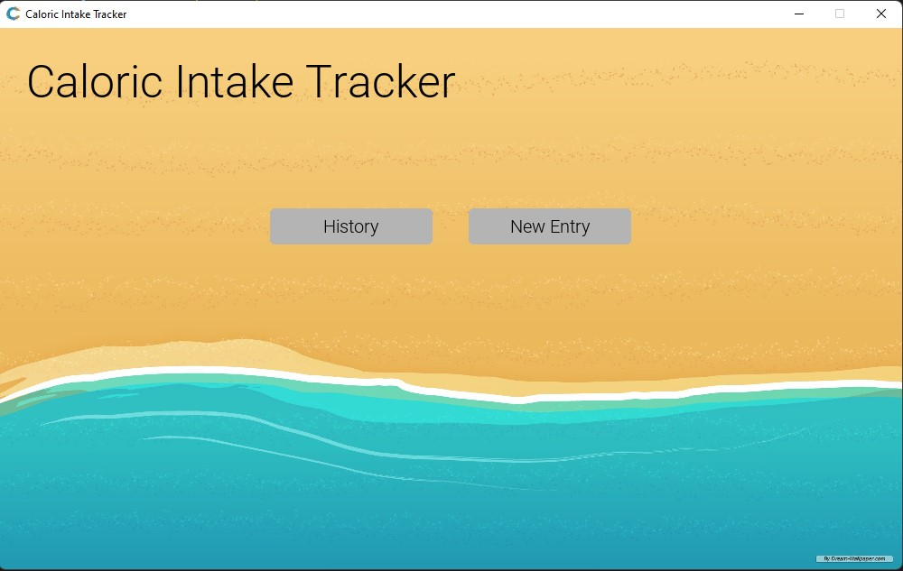

# Caloric Intake Tracker

A personal python project that uses pygame to create a caloric intake tracker. 

## Features
- Track daily caloric intake by referencing the USDA Food Central Database API
- View past entries

## Build

This requires Python 3, pygame, requests, and pandas.

Use Python's Standard Package Manager to install these libraries

```bash
pip install pygame
```
```bash
pip install requests
```
```bash
pip install pandas
```
## Usage

run main.py in an IDE or in a terminal




## Contributing
Pull requests are welcome. For major changes, please open an issue first to discuss what you would like to change.

Please make sure to update tests as appropriate.

